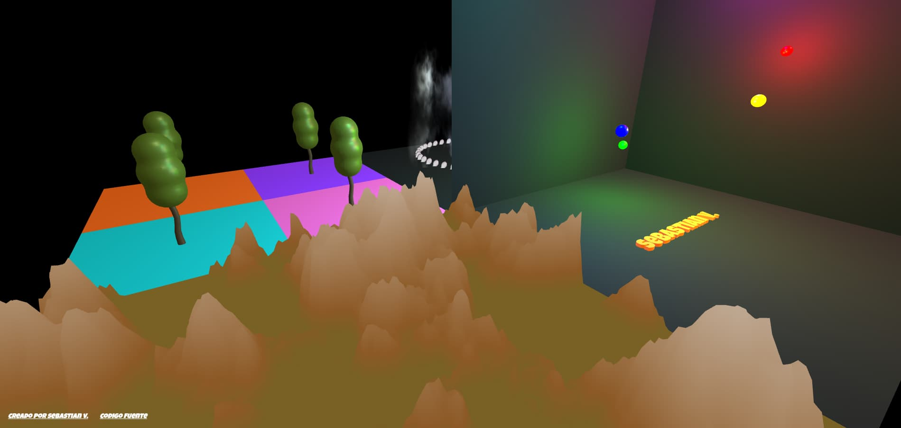

<div align="center">

# ✨🌳 Three.js Lab

**A living laboratory for experimenting with 3D graphics in the browser**

[](https://threejs.org/)
[](https://greensock.com/gsap/)
[]()

[](https://three-js-lab-nine.vercel.app/)
[](https://sebas-dev.vercel.app/)

<br>



</div>

---

## Table of Contents

- [About](#about)
- [Why This Project Exists](#why-this-project-exists)
- [Features](#features)
- [Tech Stack](#tech-stack)
- [Project Structure](#project-structure)
- [Architecture](#architecture)
- [The Scene: 5 Groups, 5 Challenges](#the-scene-5-groups-5-challenges)
- [How It Works](#how-it-works)
- [Getting Started](#getting-started)
- [Configuration](#configuration)
- [Performance](#performance)
- [Responsive Design](#responsive-design)
- [Best Practices](#best-practices)
- [Technical Decisions](#technical-decisions)
- [FAQ](#faq)
- [Future Improvements](#future-improvements)
- [Developer Notes](#developer-notes)
- [Contributing](#contributing)
- [Credits](#credits)
- [License](#license)

---

## About

This is not a copied tutorial. Not a downloaded template that was slightly modified. Every line of code here was written with a clear purpose: **to learn, to experiment, and to create something that feels alive**.

Three.js Lab is a personal laboratory where I explored everything that can be achieved with Three.js without relying on complicated build tools or heavy frameworks. Just modern HTML, vanilla JavaScript, and a genuine curiosity to understand how things work from the inside.

Each group in the scene represents a different challenge. Every texture, every shadow, every particle was placed there intentionally. There is no dead code. No leftover "just in case" features.

This project is the sum of hours of trial and error, of searching for answers, of understanding why something wasn't working, and of the deep satisfaction of finally seeing it come to life.

---

## Why This Project Exists

> The best way to learn something is to build something with it.

Rather than following a course or reading documentation passively, I chose to answer a series of technical questions by actually building the answers:

- How do you generate procedural terrain with custom shaders?
- How do you load a 3D model and clone it efficiently across a scene?
- How do you create particle systems that move organically over time?
- How do you make 3D objects interactive with raycasting?
- How do you structure a complex scene without everything becoming chaos?

Each group in the scene is a practical, working answer to one of these questions. Together, they form a complete playground for 3D experimentation on the web.

---

## Features

| Feature | Description |
|:--------|:------------|
| 🌳 Hierarchical 3D Models | Tree.glb loaded and cloned within nested sub-groups |
| 🌫️ Particle System | 40 orbiting petals + fog particle with webp texture |
| 🏔️ Procedural Terrain | Custom GLSL shader with 15 octaves of 3D Simplex noise |
| 💡 Animated Lights | 6 luminous spheres with PointLight moving sinusoidally |
| 🧊 PBR Textures | Wood (2K) and marble (1K) with full material sets |
| 🔤 Interactive 3D Text | "sebastian v." in Luckiest Guy, orange hover + click modal |
| 🪟 Animated Modal | Smooth GSAP transitions: scale, rotation, blur and fade |
| 🖱️ Orbital Controls | Free camera with damping to explore the scene |
| 📱 Responsive Design | Adapts to any window size with automatic camera updates |

---

## Tech Stack

<div align="center">

| Category | Technology | Version |
|:---------|:-----------|:--------|
| **3D Engine** | [Three.js](https://threejs.org/) | `0.170.0` |
| **Animation** | [GSAP](https://greensock.com/gsap/) | `3.12.5` |
| **Camera Controls** | OrbitControls | — |
| **Model Loading** | GLTFLoader | — |
| **3D Text** | FontLoader + TextGeometry | — |
| **Hosting** | [Vercel](https://vercel.com/) | — |

</div>

**No bundlers. No transpilers. No complexity.**

The entire project runs on native ES modules with import maps, loading dependencies directly from CDN. This was a deliberate choice — not a limitation.

---

## Project Structure

```
pratica-threejs/
│
├── index.html              ← Entry point: canvas, modal, links, importmap
├── main.js                 ← Core logic: scene, groups, shaders, animations
├── style.css               ← Styles: font, modal, canvas, footer buttons
│
├── font/
│   ├── LuckiestGuy-Regular.ttf        ← Font for CSS (modal)
│   └── Luckiest Guy_Regular.json      ← Font for Three.js (3D text)
│
├── img/
│   ├── fog-5.webp          ← Fog particle texture
│   ├── petal.webp          ← Petal texture for orbiting particles
│   └── preview.jpg         ← Project preview image
│
├── models/
│   └── Tree.glb            ← 3D tree model (GLTF Binary)
│
└── textures/
    ├── pared/              ← Marble textures for walls
    │   ├── marble_108_basecolor-1K.png
    │   ├── marble_108_height-1K.png
    │   ├── marble_108_normal-1K.png
    │   └── marble_108_roughness-1K.png
    │
    └── plane/              ← Wood textures for base floor
        ├── woodplank_39_AmbientOcclusion-2K.jpg
        ├── woodplank_39_BaseColor-2K.jpg
        ├── woodplank_39_Height-2K.jpg
        ├── woodplank_39_Normal-2K.jpg
        └── woodplank_39_Roughness-2K.jpg
```

**17 files** · **~4.5 MB of assets** · **Zero build steps**

---

## Architecture

The project follows a **single-file architecture** for the core logic (`main.js`), with HTML and CSS separated into their own files. This was intentional — for a project of this scope, over-engineering the file structure would add complexity without value.

### Core Components

```
┌─────────────────────────────────────────────────┐
│                   index.html                     │
│  Canvas (#webgl) · Modal · Footer · Importmap   │
└──────────────────────┬──────────────────────────┘
                       │
┌──────────────────────▼──────────────────────────┐
│                    main.js                       │
│                                                  │
│  ┌──────────────┐  ┌──────────────┐             │
│  │ Asset Loader │  │ Scene Setup  │             │
│  │ Promise.all  │──│ Renderer     │             │
│  │ 9 textures   │  │ Camera       │             │
│  │ 1 model      │  │ Lights       │             │
│  │ 2 particles  │  │ Controls     │             │
│  └──────────────┘  └──────┬───────┘             │
│                           │                      │
│  ┌────────────────────────▼─────────────────┐   │
│  │            Group Construction             │   │
│  │  ┌─────────┐ ┌─────────┐ ┌─────────┐    │   │
│  │  │ Group 1 │ │ Group 2 │ │ Group 3 │    │   │
│  │  │ Trees   │ │Particles│ │ Terrain │    │   │
│  │  └─────────┘ └─────────┘ └─────────┘    │   │
│  │  ┌─────────┐ ┌─────────┐                │   │
│  │  │ Group 4 │ │ Group 5 │                │   │
│  │  │ Room    │ │ Ceiling │                │   │
│  │  └─────────┘ └─────────┘                │   │
│  └──────────────────────────────────────────┘   │
│                                                  │
│  ┌──────────────┐  ┌──────────────┐             │
│  │  Raycaster   │  │   Animation  │             │
│  │  Interactions│  │   Loop       │             │
│  │  Hover/Click │  │   rAF        │             │
│  └──────────────┘  └──────────────┘             │
└─────────────────────────────────────────────────┘
```

### Data Flow

Assets load first via `Promise.all`. Only after everything is ready does the scene construction begin. This eliminates race conditions and ensures no texture or model is undefined when needed.

---

## The Scene: 5 Groups, 5 Challenges

The scene is built on a 20×20 plane divided into quadrants. Each quadrant hosts a different experiment.

### 🔴 Group 1 — Hierarchical Trees

*Position: (-5, 0.01, -5)*

A 10×10 plane with 4 sub-groups of 5×5 each. Every sub-group has a distinct color — orange, purple, cyan, pink — and a cloned Tree.glb model at half scale.

This group explores **scene graph hierarchy**: how nested groups inherit transformations, how to clone models without duplicating geometry, and how to organize complex compositions cleanly.

### 🟢 Group 2 — Particles and Fog

*Position: (5, 0.01, -5)*

A large fog particle (size 12) using `fog-5.webp` as texture, surrounded by 40 petals orbiting an invisible center at radius 3. The petals update every frame by directly manipulating the position buffer.

This group taught me that particles in Three.js aren't magic — they're **arrays of numbers you move manually**. Understanding that changed everything.

### 🔵 Group 3 — Procedural Terrain

*Position: (-5, 0.01, 5)*

The most technically demanding piece. A `ShaderMaterial` with a vertex shader implementing **15 octaves of 3D Simplex noise**. Each octave has a different frequency and amplitude, creating natural-looking elevation that ranges from green grass to brown earth to white snow.

The fragment shader colors purely by height. No textures. No tricks. Just mathematics.

```
Elevation:  max(0, simplex_noise × total_amplitude)
Color map:  green (0–40%) → brown (40–60%) → white (60–100%)
```

### 🟡 Group 4 — Room with Lights and Text

*Position: (5, 0.01, 5)*

Two marble walls — `pared-1` (back) and `pared-2` (side) — with PBR material sets. Six luminous spheres of different colors move with sinusoidal functions, each casting light via `PointLight` at intensity 150.

At the center sits the 3D text **"sebastian v."** rendered with the Luckiest Guy font. Hover to turn it orange. Click to open an animated modal.

### ⬛ Group 5 — Ceiling

*Position: (5, 10, 5)*

An inverted plane completing the room from Group 4. Simple, but essential for spatial coherence.

---

## How It Works

```
1. Browser loads index.html
   └─→ GSAP loads from CDN
   └─→ Import map resolves Three.js
   └─→ main.js executes as ES module

2. Assets load via Promise.all()
   └─→ 9 PBR textures (wood + marble)
   └─→ 2 particle textures
   └─→ 1 GLB model
   └─→ 1 font (separate load)

3. Scene constructs after all assets are ready
   └─→ WebGL renderer with antialiasing
   └─→ Perspective camera (FOV 60)
   └─→ Orbital controls with damping
   └─→ Lighting: ambient + directional + 6 point lights

4. Five groups create their objects

5. Animation loop starts (requestAnimationFrame)
   └─→ Particles orbit
   └─→ Light spheres drift
   └─→ Controls update
   └─→ Scene renders

6. Interactions listen
   └─→ Raycaster detects text hover/click
   └─→ GSAP animates the modal
   └─→ Window resize updates camera
```

---

## Getting Started

### Prerequisites

- A modern browser (Chrome, Firefox, Safari, Edge)
- A local server — `file://` won't work due to ES modules

### Installation

```bash
# Clone the repository
git clone https://github.com/sebastianvasquezechavarria1234/three.js-lab.git

# Navigate to the project
cd three.js-lab
```

### Running Locally

Choose any of these options:

```bash
# Python
python -m http.server 8000

# Node.js (if http-server is installed)
npx http-server -p 8000

# Or use VS Code's Live Server extension
```

Then open **http://localhost:8000** in your browser.

### Environment Variables

None. This is a fully static project with no backend, no APIs, and no secrets.

---

## Configuration

| Parameter | Value | Notes |
|:----------|:------|:------|
| Canvas resolution | Full window | Updates on resize |
| Max pixel ratio | 2 | Prevents HiDPI overload |
| Background color | Black (`#000000`) | — |
| Camera position | `(0, 10, 20)` | Looking at origin |
| Camera FOV | 60° | — |
| Near / Far planes | 0.1 / 1000 | — |
| OrbitControls damping | 0.05 | Smooth camera feel |
| Terrain segments | 128×128 | High detail |
| Noise octaves | 15 | Maximum complexity |
| Petal particles | 40 | — |
| Orbit radius | 3.0 | — |
| Point lights | 6 | Intensity 150, distance 25 |
| Modal animation | 0.4–0.6s | GSAP spring easing |

---

## Performance

### What Was Done Right

- **Pixel ratio capping** — `Math.min(devicePixelRatio, 2)` prevents overrendering on high-DPI displays
- **Promise.all preloading** — All textures load before scene construction, avoiding runtime hitches
- **BufferGeometry for particles** — Direct position array manipulation avoids object creation per frame
- **Reasonable segment counts** — 128×128 terrain is detailed without being excessive
- **Single render call** — No multi-pass rendering, no post-processing overhead

### Known Limitations

- The 15-octave Simplex noise shader is computationally expensive on low-end GPUs
- All 6 point lights render every frame without frustum culling optimization
- No LOD system — all geometry renders at full detail regardless of distance
- Particle positions update on the CPU, not GPU

### Possible Optimizations

- Reduce noise octaves on mobile devices
- Implement light culling or baking
- Move particle animation to a GPU compute shader
- Add frustum culling for off-screen objects

---

## Responsive Design

The scene adapts automatically to any window size:

- **Camera aspect ratio** updates on resize
- **Renderer size** matches the new viewport
- **Canvas** uses `position: fixed` to fill the screen
- **Modal** uses CSS transforms that scale relative to viewport

No media queries. No breakpoints. The 3D scene itself is inherently responsive — it just works at any size.

---

## Best Practices

- **Promise.all for asset loading** — Everything loads before scene construction, eliminating race conditions
- **Pixel ratio capping** — Protects mobile GPUs from overrendering
- **ES modules without bundler** — Import maps load Three.js directly from CDN, zero build step
- **Hierarchical scene graph** — Nested groups manage relative transformations cleanly
- **Mixed material strategy** — `MeshStandardMaterial` for standard objects, `ShaderMaterial` for procedural terrain
- **Manual buffer manipulation** — Direct position array updates for efficient particle movement
- **NDC-based raycasting** — Normalized device coordinates ensure precise interaction detection

---

## Technical Decisions

### Why no bundler?

For a project of this scope, Webpack or Vite would add configuration overhead without meaningful benefit. ES modules with import maps load Three.js directly from CDN — faster to start, zero build time, and completely transparent.

### Why GSAP for modal only?

GSAP excels at DOM animation with its spring easings and timeline control. Three.js handles all 3D animation internally. Mixing them would create unnecessary coupling.

### Why 15 octaves of noise?

More octaves = more detail. With 15 layers, the terrain has both large-scale mountain shapes and fine-grain surface detail. It's computationally expensive, but this is a learning project — clarity over optimization.

### Why manual particle animation?

Using `BufferGeometry` with direct position updates gives full control over particle behavior. It's more verbose than a particle system library, but it teaches you exactly what's happening under the hood.

---

## FAQ

<details>
<summary><strong>Why can't I open the project with file://?</strong></summary>

ES modules require a server context. The browser blocks `import` statements from `file://` for security reasons. Use any local server.

</details>

<details>
<summary><strong>Why are some textures loaded but not visible?</strong></summary>

The wood textures (normal, roughness, AO) are loaded and available but only the basecolor is currently applied to the base plane. This was intentional — they're ready for future enhancement.

</details>

<details>
<summary><strong>Why is the terrain static?</strong></summary>

The terrain shader generates elevation once. Adding animation would require updating the vertex buffer every frame, which is possible but wasn't the goal for this experiment.

</details>

<details>
<summary><strong>Can I use this in my own project?</strong></summary>

Yes. The code is open source. Study it, learn from it, adapt it. That's exactly why it exists.

</details>

---

## Future Improvements

- [ ] Dynamic shadows with `ShadowMap`
- [ ] Post-processing pipeline (bloom, SSAO)
- [ ] 3D positional audio
- [ ] More procedural shaders (water, fire, clouds)
- [ ] Animation mixer integration
- [ ] LOD (Level of Detail) for distant models
- [ ] GPU compute-based particle system
- [ ] Terrain animation (wind, erosion)
- [ ] Interactive light color picker
- [ ] Mobile touch controls optimization

---

## Developer Notes

> **Wood textures** (`textures/plane/`) are loaded but only the basecolor is applied. The other layers — normal, roughness, AO — are available for a more realistic finish.

> **Marble textures** are applied differently per wall: `pared-1` uses only basecolor, while `pared-2` uses the full PBR package.

> **Terrain clamping** uses `max(0, elevation)` to prevent negative values that would create geometry below the plane.

> **Dual font loading** — Luckiest Guy loads as `.ttf` for CSS (modal) and `.json` for Three.js (3D text).

> **GSAP scope** — Only used for DOM animations (modal), never for 3D object transformations.

> **Light timings** are randomly generated with `Math.random()` when creating each sphere, ensuring no two bulbs move identically.

---

## Contributing

This is a personal learning project, but contributions are welcome:

1. Fork the repository
2. Create a feature branch (`git checkout -b feature/amazing-feature`)
3. Commit your changes (`git commit -m 'Add amazing feature'`)
4. Push to the branch (`git push origin feature/amazing-feature`)
5. Open a Pull Request

---

## Credits

| Resource | Source |
|:---------|:-------|
| 3D Engine | [Three.js](https://threejs.org/) |
| Animations | [GSAP](https://greensock.com/gsap/) |
| Typography | [Luckiest Guy](https://fonts.google.com/specimen/Luckiest+Guy) |
| PBR Textures | [ambientCG](https://ambientcg.com/) |
| Simplex Noise | Based on work by Stefan Gustavson & Ashima Arts |
| Hosting | [Vercel](https://vercel.com/) |

---

## License

This project is open source. Feel free to use it as a reference for your own experiments.

---

<div align="center">

*Some projects aren't built to solve a problem.*
*They're built to ask questions.*

*And sometimes, on the way to finding answers,*
*you end up creating something you didn't even know could exist.*

*This project is that.*

<br>

**Sebastián V** ❤️

[Portfolio](https://sebas-dev.vercel.app/) · [GitHub](https://github.com/sebastianvasquezechavarria1234/three.js-lab)

</div>
